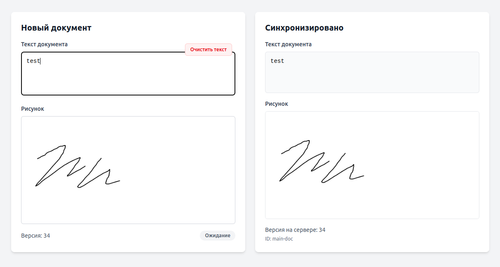

# LocalFirst

## Docker

```bash
# поднять окружение
$ docker compose up -d

# пересоздать контейнеры с очисткой томов
# docker compose down -v
# docker compose up -d
```

## Server/Client

```bash
# перейти в папку server/client
$ cd server
$ cd client

# установить зависимости
$ npm i

# запустить приложение
$ npm run dev
```

